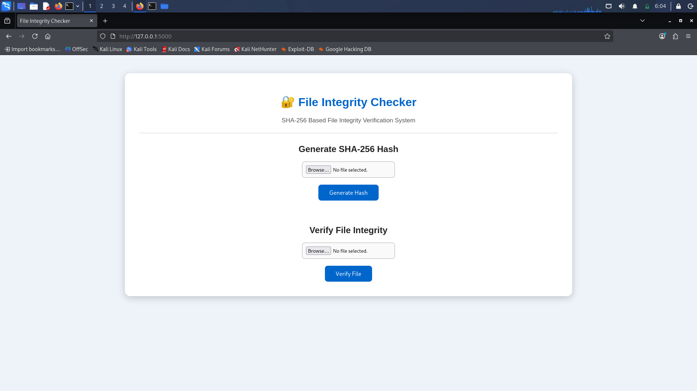
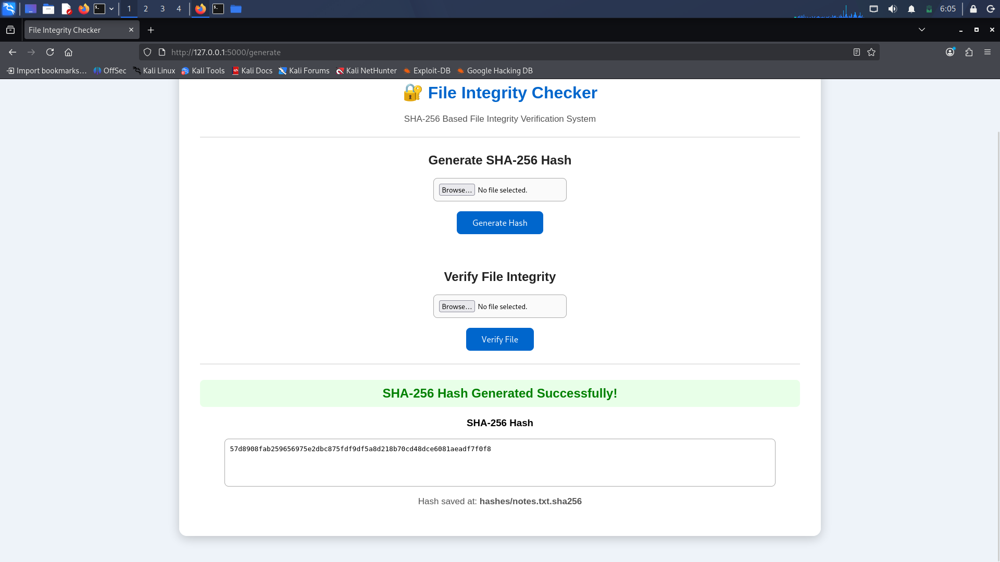

# 🔒 File Integrity Checker (SHA-256) – Web Application

A web-based **File Integrity Checker** built using **Python, Flask, HTML, and CSS** that verifies whether a file has been modified or tampered with by comparing its **SHA-256 cryptographic hash**.

This project was developed as part of a cybersecurity internship to demonstrate the practical use of cryptographic hashing for ensuring file integrity.

---

## 📌 Features

* Generate SHA-256 hash for any uploaded file
* Store generated hash in a `.sha256` file
* Verify file integrity by comparing current and stored hashes
* Detect file modifications or tampering
* User-friendly web interface built with Flask
* Displays current hash and stored hash for comparison

---

## 🛠️ Technologies Used

* Python 3
* Flask
* HTML5
* CSS3
* SHA-256 (hashlib)

---

## 📂 Project Structure

```text
FileIntegrityChecker-Web/
│
├── app.py
├── generate.py
├── verify.py
├── hash_utils.py
├── requirements.txt
├── README.md
│
├── templates/
│   └── index.html
│
├── static/
│   └── style.css
│
├── uploads/
├── hashes/
├── screenshots/
└── venv/
```

---

## 🚀 Installation

### 1. Clone the repository

```bash
git clone https://github.com/atifali005/FileIntegrityChecker-Web.git
```

### 2. Navigate to the project folder

```bash
cd FileIntegrityChecker-Web
```

### 3. Create a virtual environment (optional)

```bash
python3 -m venv venv
```

### 4. Activate the virtual environment

**Linux / Kali**

```bash
source venv/bin/activate
```

### 5. Install dependencies

```bash
pip install -r requirements.txt
```

### 6. Run the application

```bash
python app.py
```

### 7. Open in your browser

```text
http://127.0.0.1:5000
```

---

## 🧪 How to Use

### Generate a Hash

1. Open the application.
2. Click **Choose File**.
3. Select a file.
4. Click **Generate Hash**.
5. The SHA-256 hash is displayed and saved in the `hashes/` folder.

### Verify File Integrity

1. Select the same file.
2. Click **Verify File**.
3. The application compares the current hash with the stored hash.
4. A success message is displayed if both hashes match.
5. If the hashes differ, the application reports that the file has been modified.

---

## 📸 Screenshots


* `interface.png`
* `hash.png`
* `integrity.png`

### Home Page



### Generate SHA-256 Hash



### Verification Successful


---

## 🔐 How It Works

1. User uploads a file.
2. The application calculates its SHA-256 hash.
3. The hash is stored in a `.sha256` file.
4. During verification, a new SHA-256 hash is generated.
5. The current hash is compared with the stored hash.
6. Matching hashes confirm file integrity; different hashes indicate the file has been modified.

---

## 🎯 Learning Outcomes

* Flask web development
* File handling in Python
* Cryptographic hashing (SHA-256)
* File integrity verification
* HTML and CSS integration with Flask
* Git and GitHub project management

---

## 🔮 Future Enhancements

* Support multiple file verification
* Downloadable verification reports
* User authentication
* Hash history using a database
* Drag-and-drop file upload
* Cloud storage integration

---

## 👨‍💻 Author

**Syed Atif Ali**

Bachelor of Engineering (Information Technology)

Cybersecurity Internship Project
